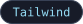
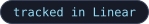

# naxecode.github.io

Personal site for Aladdin Ali (Naxe): backend & platform engineer, making games since 2015.

[](#status)





## What it does
- Single-page portfolio: projects, experience, about, and journey sections, plus a detail page per project.
- All copy lives in `data/*.json` and is validated with Zod at build time (`types/`, `lib/data-loader.ts`).
- The look follows the brand generator in [`NaxeCode/.github/brand/gen.py`](https://github.com/NaxeCode/NaxeCode/tree/main/.github/brand): tokens and bands in `lib/brand.ts`, the sky in `app/globals.css` and `public/stars.svg`, project tiles in `public/tiles/`.

## How it works
Next.js App Router with `output: 'export'`, so the build is a static `out/` folder. Pushing to `main` runs `.github/workflows/nextjs.yml`, which builds the site and deploys it to GitHub Pages.

## Getting started
```bash
npm ci
npm run dev     # local dev server
npm run build   # static export to out/
```

## Status
Live at https://naxecode.github.io.

## How this project is run

[](https://linear.app)
[](#how-this-project-is-run)
[](#how-this-project-is-run)

- **Planning:** tracked in Linear as initiatives → projects → milestones → issues; branch names and PR titles carry the issue ID.
- **Review:** every pull request gets a Codex review before merge.
- **Guardrails:** the default branch changes only through pull requests (GitHub ruleset).

## License

MIT. See [LICENSE](LICENSE).

---
<sub>Built by [Aladdin Ali](https://github.com/NaxeCode) · [naxecode.github.io](https://naxecode.github.io)</sub>
